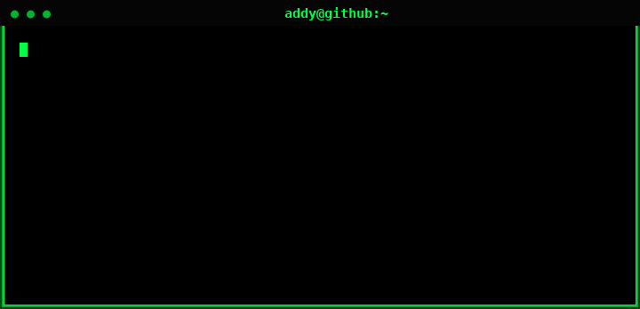

# hola! <3

hey, i'm aditi 👋

just a girl who loves coffee, code & creating things on the internet ☕️💻  

---

🚀 venture research & growth intern @ sh1p (sf)  
🤖 into ai, robotics & biotech  
🎤 also into music (yes i sing)  

---

## ✧ things i like
reading 📚  
gaming 🎮  
building random cool stuff  
late night ideas that feel life changing  
coffee. a lot of it.  

---

## ✧ currently
learning ai + creating content
building in public
figuring things out as i go  

---

## ✧ goals
mit? yeah.  
building something big someday  
doing work that actually matters  

---

## >w<

  

---

## ✧ stats

